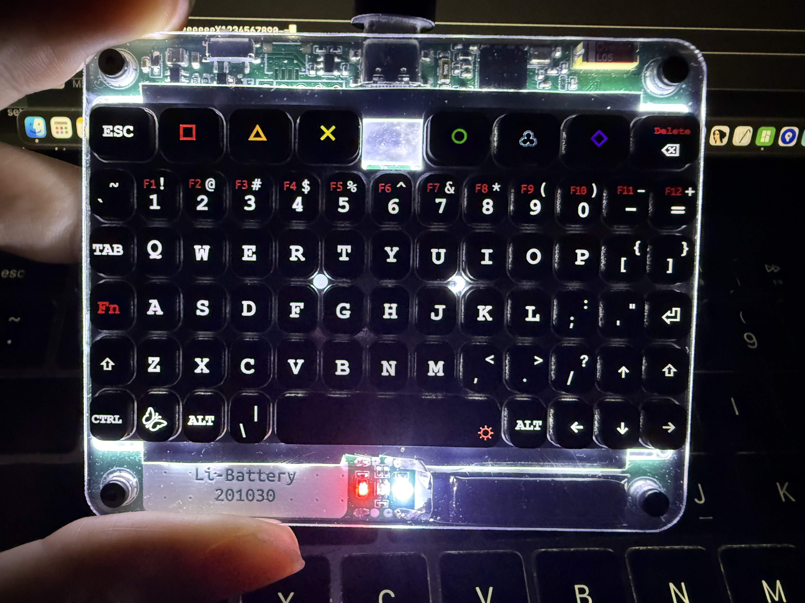
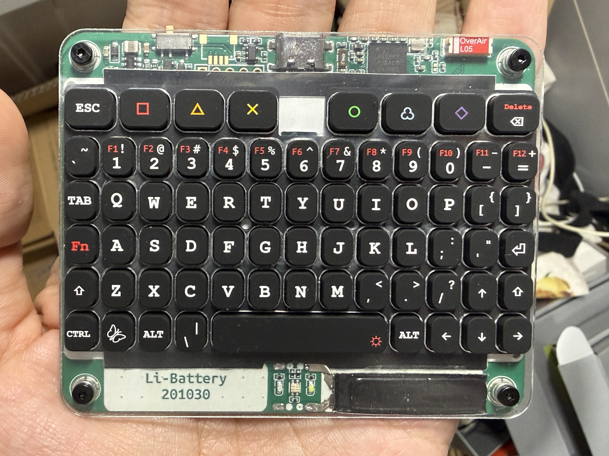

# CyberFly Keyboard

A compact BLE mechanical keyboard powered by nRF52840 (E73-2G4M08S1C module) running [ZMK](https://zmk.dev/) firmware.

## Features

- nRF52840 BLE 5.0 + USB-C dual mode
- 6-row compact QWERTY layout with PlayStation-style function keys
- Built-in Li-battery with charging
- Open-source hardware and firmware ([MIT](LICENSE))
- USB VID:PID `1209:CF01` ([pid.codes](https://pid.codes/1209/CF01/))

## Photos

| Front (backlight on) | Front (daylight) |
|---|---|
|  |  |

## Firmware

This repository is a fork of [ZMK Firmware](https://zmk.dev/) with CyberFly-specific board definitions and keymap configurations.

Check out the ZMK website to learn more: https://zmk.dev/
